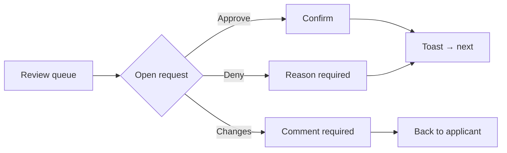

# Output Notation & Templates

How to present design work in text so it's precise, buildable, and reviewable without a Figma file. Pick the pieces the request needs — you rarely need all of them.

**Contents:** 1) User-flow notation · 2) Wireframe / layout notation · 3) Component-spec format · 4) Design-spec document structure · 5) Rendering a visual mockup.

---

## 1. User-flow notation

For a linear flow, an arrow chain is enough:

```
Entry (email link) → Sign-in → Review queue → Open request → Approve/Deny → Toast + return to queue
```

For branches, use an indented tree or a small Mermaid diagram:

```
Open request
├─ Approve → confirm dialog → success toast → next in queue
├─ Deny → require reason → success toast → next in queue
└─ Request changes → comment (required) → sent back to applicant
```



Always include the important **error and empty branches**, not just the happy path — they're where flows break.

## 2. Wireframe / layout notation

Use monospace ASCII boxes to show structure, hierarchy, and placement. Label regions, use realistic content (not "lorem ipsum"), and mark the primary action. Keep it structural — no color at this stage.

```
┌─────────────────────────────────────────────────────────────┐
│ ☰  CCC Secondary Appointments            🔔 3   ⌘K   [+ New]  │  ← top bar (h-14)
├───────────┬─────────────────────────────────────────────────┤
│ Sidebar   │  Review queue                        [Filter ▾]  │  ← page title + count
│ • Queue ◀ │  ┌─────────┐ ┌─────────┐ ┌─────────┐              │
│ • All     │  │  12     │ │   4     │ │   28    │  ← stat tiles │
│ • People  │  │ Pending │ │ Overdue │ │ Approved│    (clickable)│
│ • Reports │  └─────────┘ └─────────┘ └─────────┘              │
│           │  ┌───────────────────────────────────────────┐   │
│           │  │ Name            Dept        Submitted  ▸   │   │  ← table header (quiet)
│           │  │ Jane Frist      EECS        Jul 12   [Approve]│ │  ← row + inline action
│           │  │ …                                          │   │
│           │  └───────────────────────────────────────────┘   │
└───────────┴─────────────────────────────────────────────────┘
```

Annotate with sizes/tokens inline (`← h-14`, `← p-6`) or in a short legend beneath. For responsive, show the mobile reflow as a second, narrow frame:

```
Mobile (<lg): sidebar → hamburger; table → stacked cards
┌───────────────────────┐
│ ☰  Appointments  🔔 ⌘K │
├───────────────────────┤
│ [12 Pending][4 Overdue]│  ← tiles wrap 2-up
│ ┌───────────────────┐ │
│ │ Jane Frist        │ │  ← row as card
│ │ EECS · Jul 12     │ │
│ │ [Approve] [Open]  │ │
│ └───────────────────┘ │
└───────────────────────┘
```

## 3. Component-spec format

Specify a component once, fully — variants, every state, tokens, behavior, and a11y. Template:

```
### <ComponentName>
Purpose: <one line — what it's for, when to use it>

Anatomy: <parts, e.g. icon slot + label + trailing chevron>

Variants:
  - <name>: <visual — bg/text/border tokens>
  - …

Sizes: <e.g. sm h-8 / default h-9 / lg h-10, with padding>

States (specify each that applies):
  - Default: <tokens>
  - Hover:   <tokens>
  - Focus:   <visible ring — ring-[3px] ring-ring/50>
  - Active/pressed: <tokens>
  - Disabled: <muted tokens, NOT opacity; cursor-not-allowed>
  - Loading:  <inline spinner + aria-busy; disabled>
  - Error/invalid (inputs): <red border/ring + aria-invalid>

Tokens: radius <rounded-md>, text <text-sm font-medium>, gap <gap-2>

Behavior: <interaction, keyboard, what it does>

Accessibility: <accessible name source, ARIA, keyboard model>

Implementation: <Tailwind classes / shadcn variant / cva signature; file location if in a repo>
```

Worked example:

```
### Button — primary
Purpose: the single most important action on a screen or in a dialog.
Variants: default (bg-primary #18181B, text primary-foreground), + gold CTA (bg-gold-500 #F2CC0C, text black) for Vanderbilt-forward pages.
Sizes: default h-9 px-4; sm h-8; lg h-10 px-6.
States: Hover bg-primary/90; Focus ring-[3px] ring-ring/50; Disabled opacity-60 + not-allowed; Loading spinner + aria-busy.
Tokens: rounded-md, text-sm font-medium, gap-2, shadow-xs.
Behavior: one primary per view; keeps its verb into the success toast.
Accessibility: text label or aria-label (icon-only requires aria-label); Enter/Space activate.
Implementation: shadcn Button variant="default" size="default"; or `.btn-primary` @apply class.
```

## 4. Design-spec document structure

For a substantial deliverable (a new screen/feature/tool), write it to a markdown file using this skeleton (also in `../assets/spec-template.md`). Scale sections to the ask — drop what's irrelevant.

```
# <Feature/Screen> — Design Spec

## 1. Context & goals
Who the user is, what they're accomplishing, device/frequency, success measure.

## 2. Assumptions & open questions
What you assumed (named, so it's cheap to correct) and what you still need.

## 3. User flow
Arrow chain / tree / diagram, incl. error + empty branches.

## 4. Layout & wireframe
ASCII wireframe(s), desktop + mobile reflow, with hierarchy notes.

## 5. High-fidelity UI
Screen-by-screen: components used (with variants/states), spacing, type, color tokens, imagery/icons. Concrete values throughout.

## 6. Component specs
Any new/changed components in the format above.

## 7. Design tokens
New/changed tokens (or a pointer to the shared token file).

## 8. Accessibility review
Result of the checklist — contrast pairs, focus/keyboard, semantics, states, motion; note any unresolved AA risk.

## 9. Design rationale
The load-bearing decisions: choice → reason → rejected alternative.

## 10. Implementation guidance
Stack mapping — Tailwind classes / component names / file locations, build order, anything the developer needs to not guess.
```

## 5. Rendering a visual mockup

Text specs are precise but hard to *feel*. When a picture would resolve ambiguity, offer to render one:

- **HTML/React artifact** — the highest-value option: a real, interactive mockup in the actual token system (Tailwind + the house colors), so the user sees the real thing and can react. Use it for a screen or component in context.
- **SVG wireframe** — a quick, static structural sketch when interactivity isn't needed.
- Keep mockups faithful to the tokens in `ccc-design-system.md`; a mockup that uses off-system colors teaches the wrong thing.
- Don't force it — a small tweak ("increase the gap") doesn't need a render; a new screen usually benefits from one.
